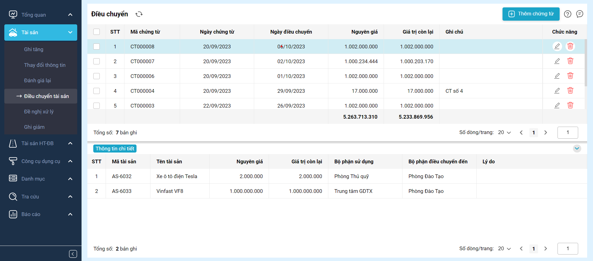

# Phần mềm Quản lý Tài sản - Hiển thị và Chuyển Tài sản

## Tổng quan

Thư mục này chứa mã nguồn cho các tính năng hiển thị và điều chuyển tài sản trong Phần mềm Quản lý Tài sản. 

## Tính năng

### 1. Hiển thị Tài sản

- Hiển thị một danh sách toàn diện của tất cả tài sản trong tổ chức.
- Lọc và tìm kiếm tài sản dựa trên nhiều tiêu chí, chẳng hạn như loại tài sản, bộ phận sử dụng...
- Xem thông tin chi tiết về từng tài sản.
- Thêm, sửa, xóa tài sản.

### 2. Điều chuyển tài sản

- Hiển thị thông tin các chứng từ tài sản.
- Cho phép thêm sửa, xóa các chứng từ theo các mô tả nghiệp vụ của phần mềm

